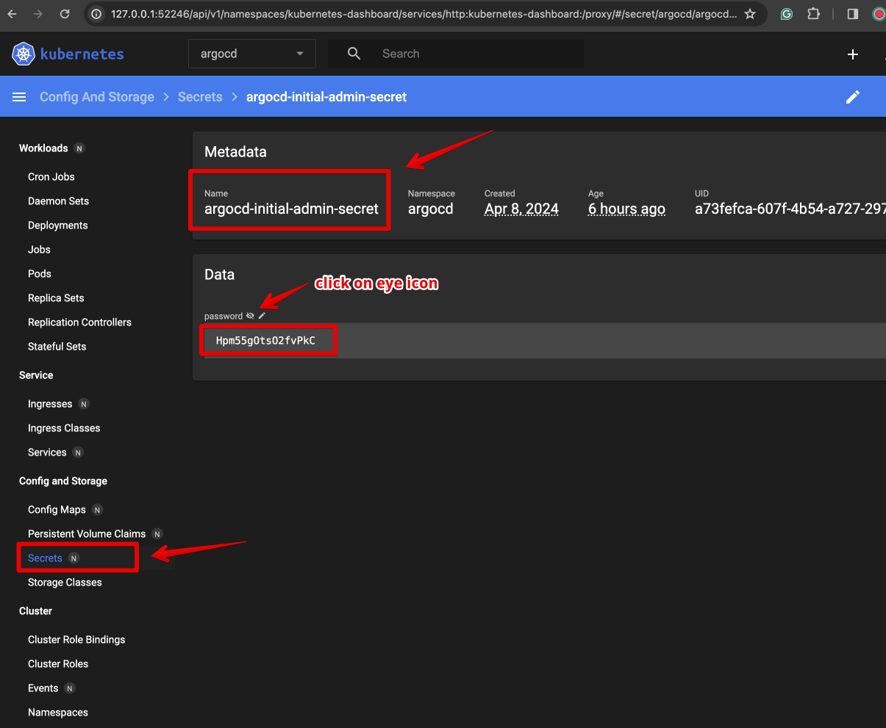

# Install and start minikube

Get the installation instructions for your system at https://minikube.sigs.k8s.io/docs/start/ \
Start minikube with ```minikube start```


# Start minikube dashboard

Open a new terminal window and run ```minikube dashboard```


# Create namespace for ArgoCD and install it

```kubectl create namespace argocd```

```kubectl apply -n argocd -f https://raw.githubusercontent.com/argoproj/argo-cd/stable/manifests/install.yaml```


# ArgoCD GUI

Configure port forward for ArgoCD GUI \
```kubectl port-forward svc/argocd-server -n argocd 8080:443&```

Open ```localhost:8080``` in your browser. \
Accept the self-signed certificate.


User name - **admin** \
Password - **get it from secrets, see screenshot**




# Create app
- you should have a git repo with the app. My app repo - https://github.com/alexanderlukjanenko/go-demo-app
- AgroCD GUI press **+ NEW APP** button

## configure general section
- Application name: demo
- Default project
- Sync policy: Manual
- Sync options: Auto-create namespace 


## configure source and destination sections
- Repo URL
- Path: helm
- Cluster URL: select from dropdown
- Set app's namespace. demo in my case 


## press on Create button


# Sync the app and wait while k8s start pods and other resources


# App is up and running

Check the app status, it should be synced, all pods up and running


# Modify configuration at git repo
- let's change the 
```yaml
api-gateway: 
    ...
    service: 
        type: LoadBalancer
``` 

from ```LoadBalancer``` to ```NodePort``` @ ```helm/values.yaml``` file

- modify the file and commit changes to the git repo

- refresh app at ArgoCD GUI, it should show the ```Out of sync``` status


- press **Sync** button and wait for ArgoCD to apply changes

- verify the applied changes


# Verify the app
- configure port forward \
```kubectl port-forward -n demo svc/ambassador 8081:80```
- load the \
```localhost:8081```


# Test the image to ascii graphic API
- Prepare the image, for example the logo.png file
- upload it to the ```img``` app endpoint \
```curl -F 'image=@logo.png' localhost:8081/img/```


